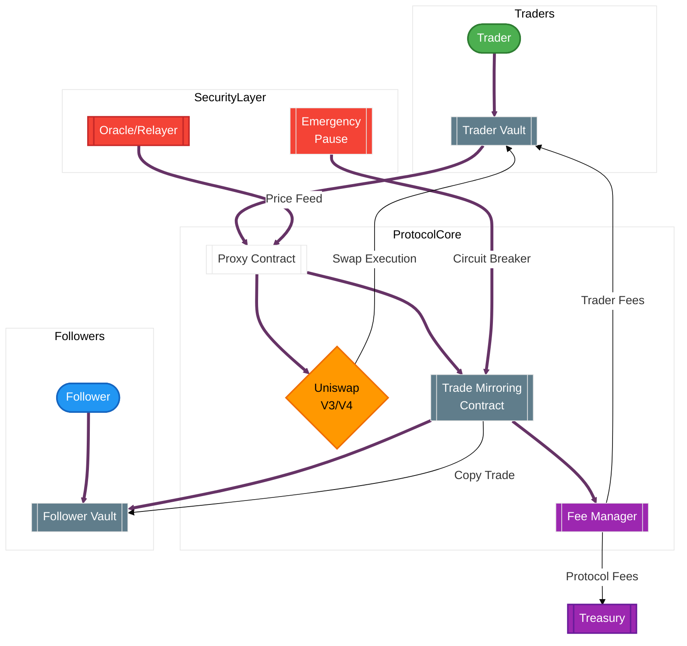

# On-Chain Copy Trading Protocol

A decentralized protocol enabling real-time copy trading on Uniswap V3/V4 with non-custodial vault management.

## Table of Contents

- [Protocol Overview](#protocol-overview)
- [Architecture](#architecture-overview)
- [Key Features](#key-features)
- [Technical Specs](#technical-specifications)
- [Installation](#installation)
- [Usage](#usage)
- [Roadmap](#roadmap)
- [License](#license)

## Protocol Overview

The On-Chain Copy Trading Protocol allows users to:

- **Traders**: Create vaults and execute trades on Uniswap
- **Followers**: Copy trades proportionally in real-time
- **Earn Fees**: Traders earn performance fees, protocol collects transaction fees

Built with security-first principles using:

- Non-custodial vault architecture
- Reentrancy-protected contracts
- Chainlink-powered price oracles
- Dynamic slippage controls

## Architecture Overview

### Key Features

#### Core Components

- Trader Vault: Non-custodial fund pool for strategy execution
- Follower Vault: Isolated vault for copied positions
- Proxy Contract: Unified interface for Uniswap interactions
- Trade Mirroring: Real-time proportional trade replication

#### For Traders

- Performance fee setting (0-20%)
- Historical trade analytics
- Follower growth dashboard
- Risk parameter configuration

#### For Followers

- 1-click copy trading
- Multiple trader following
- Stop-loss protection
- Gas-optimized execution
